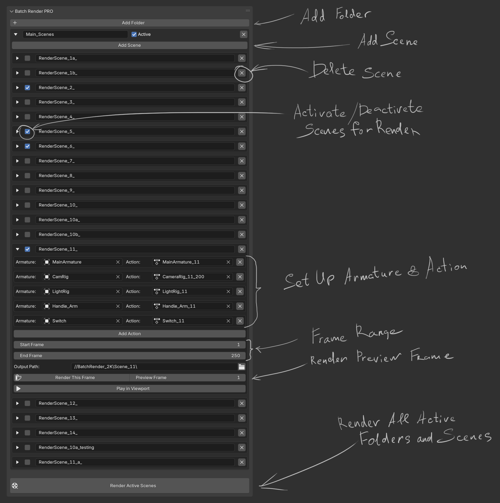

# Batch Render PRO: Powerful & Stable Animation Batch Render Manager for Blender

 Tired of losing the order of your animations when rendering in Blender? **Batch Render PRO** is the solution that lets you easily manage multiple animation actions for different armatures and render them in batches, maintaining absolute control over order and settings, regardless of dynamic changes in your scene. **Glory to Ukraine!**

## Key Features:

* **Reliable Stability:** Uses Blender's unique internal references (`PointerProperty`) instead of names, ensuring your assigned actions and armatures remain consistently linked to the correct render scenes, even after adding new data or opening the file on a different computer.
* **Effortless Batch Rendering:** Set up and render multiple animation sequences for different armatures in a single process. Perfect for projects with many characters or animations.
* **Folder Management:** Organize your render settings into logical folders for better navigation and management of large projects.
* **Individual Scene Settings:** For each render scene, you can customize:
    * **Frame Range:** Specify start and end frames.
    * **Output Path:** Set an individual save path for each scene.
    * **Scene/Folder Activity:** Easily enable or disable rendering for individual scenes or entire folders.
* **Instant Preview:** Set a "preview frame" and quickly render it to ensure everything is set up correctly.
* **"Play in Viewport" with Auto-Assignment:** Quickly preview animation directly in Blender's viewport, with the addon automatically applying the relevant actions to armatures before playback begins.
* **User-Friendly Interface:** Updated UI with improved spacing and fold/unfold functionality for better organization.

## Installation:

1.  **Download** the latest version of the addon: [batch_render_pro.py](https://github.com/YOUR_USERNAME/BatchRenderPro/releases/latest/download/batch_render_pro.py) 2.  **Open Blender.**
3.  Go to `Edit > Preferences > Add-ons`.
4.  Click the `Install...` button and select the downloaded **`batch_render_pro.py`** file.
5.  After installation, find the addon by its name "**Batch Render PRO**" in the list and check the box to enable it.
6.  The addon will appear under `Render Properties > Batch Render Setup`.

## Usage:

1.  Navigate to `Render Properties` in Blender.
2.  Expand the `Batch Render Setup` panel.
3.  **Add folders** to organize your render scenes.
4.  **Add scenes** within your folders.
5.  For each scene, **add actions** by selecting the corresponding armature and animation from the dropdown lists.
6.  Configure the **frame range** and **output path** for each scene.
7.  Use the **"Render This Frame"** button for quick previews or **"Play in Viewport"** to test your animation.
8.  Click **"Render Active Scenes"** to start batch rendering all active scenes.

## Development & Support:

If you have suggestions, find bugs, or wish to contribute, please open an "Issue" or create a "Pull Request" on GitHub.

## License:

This addon is distributed under the **MIT License**.
See the [LICENSE.md](https://github.com/YOUR_USERNAME/BatchRenderPro/blob/main/LICENSE.md) file for more details. ```

---
